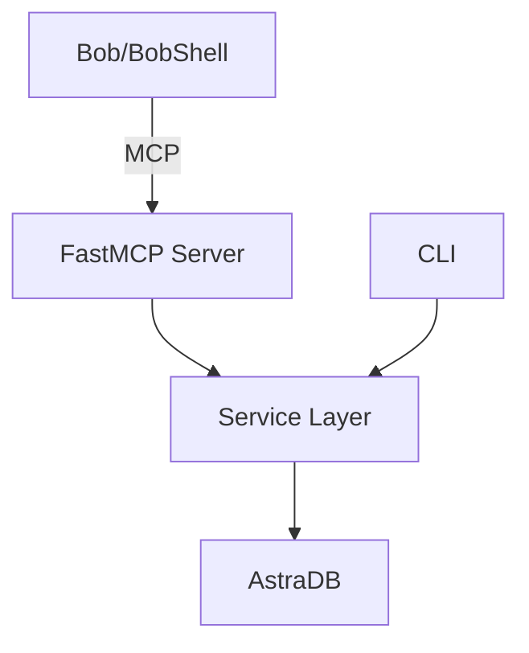

# AstroBob — Solo Hackathon Implementation Guide

> **Optimized for 48-hour sprint execution**  
> **Target**: IBM Bob Hackathon, May 15–17, 2026  
> **Status**: Ready for T0 kickoff

---

## 🎯 Executive Summary

**What**: Memory-powered agent toolkit giving IBM Bob persistent semantic/episodic/procedural memory via AstraDB  
**Why**: AI agents forget everything between sessions — AstroBob fixes that  
**Win Condition**: Bob learns from experience, remembers procedures, and writes its own skills

### Critical Success Metrics
1. ✅ `astrobob init` → Bob sees MCP tools in < 5 minutes
2. ✅ Bob successfully stores and retrieves memories
3. ✅ `astrobob skills sync` exports procedural memory as native Bob skill
4. ✅ 90-second demo video shows self-improvement loop
5. ✅ Bob session report proves real usage during build

---

## 📋 Pre-Flight Checklist (Complete Before T0)

### Environment Setup
- [x] Bob trial active (30+ Bobcoins)
- [x] AstraDB Serverless in `us-east-2` (hybrid+rerank enabled)
- [ ] **CRITICAL**: Test AstraDB Studio access — create/delete dummy collection
- [x] `uv` installed + Python 3.12
- [x] GitHub repo `astrobob` (public, MIT)
- [ ] Screen recording software installed (Screen Studio/Loom)
- [ ] Mic tested for voiceover
- [ ] Join lablab Discord + IBM Community Slack

### Quick Decisions Reference

| Decision | Value | Rationale |
|----------|-------|-----------|
| Language | Python 3.12+ | Bob ecosystem standard |
| Package Manager | `uv` | Fast, modern, deterministic |
| Memory Backend | AstraDB Serverless | IBM-owned, vectorize built-in |
| Embedding | NVIDIA NV-Embed-QA-E5-V5 | Astra-hosted, no extra keys |
| MCP Transport | STDIO (primary) | Bob native support |
| Memory Types | 3 long-term only | Working memory deferred to v0.2 |
| Demo Strategy | Pre-recorded | Zero live-coding risk |

---

## 🏗️ Architecture Overview

### System Layers (Top to Bottom)

```
┌─────────────────────────────────────┐
│  Bob / BobShell (MCP Client)        │
└─────────────┬───────────────────────┘
              │ MCP STDIO/HTTP
┌─────────────▼───────────────────────┐
│  FastMCP Server (5 tools)           │
│  remember·recall·reflect·forget·audit│
└─────────────┬───────────────────────┘
              │
┌─────────────▼───────────────────────┐
│  Service Layer (core/)              │
│  MemoryStore·Retriever·Reflector    │
└─────────────┬───────────────────────┘
              │ astrapy
┌─────────────▼───────────────────────┐
│  AstraDB (3 collections)            │
│  semantic·episodic·procedural       │
└─────────────────────────────────────┘
```

### Memory Types (The Core Concept)

| Type | Purpose | Example | Lifecycle |
|------|---------|---------|-----------|
| **Semantic** | Stable facts | "Project uses FastAPI 0.104" | Update+supersede |
| **Episodic** | Events that happened | "Fixed auth bug on 2026-05-15" | Append-only |
| **Procedural** | Reusable playbooks | "How to add MCP tool: 5 steps" | Curate by success_count |

**Key Insight**: Reflections convert episodic → procedural via `reflect()` tool

---

## 🔧 Component Implementation Guide

### Phase 1: Foundation (T0 → T+6h)
**Goal**: `astrobob astra setup` works end-to-end

#### 1.1 Project Skeleton (T+0:30)
**File**: `pyproject.toml`
```toml
[project]
name = "astrobob"
version = "0.1.0"
requires-python = ">=3.12"
dependencies = [
    "mcp[cli]>=1.0.0",
    "astrapy>=2.0.0",
    "typer>=0.12.0",
    "rich>=13.0.0",
    "pydantic>=2.0.0",
    "python-dotenv>=1.0.0",
    "python-ulid>=2.0.0",
    "jinja2>=3.1.0",
]

[project.optional-dependencies]
dev = [
    "pytest>=8.0.0",
    "pytest-asyncio>=0.23.0",
    "ruff>=0.4.0",
    "mypy>=1.10.0",
]

[project.scripts]
astrobob = "astrobob.cli.app:main"
```

**Action**: `uv init` → copy above → `uv sync`

#### 1.2 Configuration (T+1:00)
**File**: `src/astrobob/config.py`

**Critical Requirements**:
- Fail-fast on missing `ASTRA_DB_API_ENDPOINT` or `ASTRA_DB_APPLICATION_TOKEN`
- Load via `python-dotenv`
- Never log token values
- Exit code 1 with clear error message

**File**: `src/astrobob/errors.py`
```python
class AstroBobError(Exception): pass
class ConfigError(AstroBobError): pass
class AstraConnectionError(AstroBobError): pass
class MemoryNotFoundError(AstroBobError): pass
```

#### 1.3 Data Models (T+1:30)
**File**: `src/astrobob/models.py`

**Core Schema** (uniform across all 3 collections):
```python
from pydantic import BaseModel, Field
from datetime import datetime
from typing import Literal

class Provenance(BaseModel):
    derived_from: list[str] = []  # episode _ids
    session_id: str | None = None
    tool_call_id: str | None = None
    bob_skill_used: str | None = None

class MemoryDocument(BaseModel):
    # Identity
    _id: str  # ULID
    memory_type: Literal["semantic", "episodic", "procedural"]
    project: str
    scope: Literal["project", "user", "global"] = "project"
    
    # Content
    content: str  # indexed via $vectorize
    summary: str | None = None
    tags: list[str] = []
    importance: int = Field(ge=1, le=5, default=3)
    confidence: float = Field(ge=0.0, le=1.0, default=1.0)
    
    # Provenance
    source: Literal["bob", "bobshell", "wxo", "cli", "user"] = "cli"
    provenance: Provenance = Field(default_factory=Provenance)
    supersedes: str | None = None
    
    # Lifecycle
    created_at: datetime
    updated_at: datetime
    deleted_at: datetime | None = None
    last_accessed_at: datetime | None = None
    access_count: int = 0
    success_count: int = 0
    
    # Skill export (procedural only)
    exported_as_skill: str | None = None
    exported_at: datetime | None = None
```

**Why uniform schema?** Future-proofs for single-collection optimization

#### 1.4 Astra Client (T+2:30)
**File**: `src/astrobob/astra/client.py`

**Must implement**:
- `get_database()` → astrapy Database instance
- `test_connection()` → bool (for `astrobob doctor`)
- `find_and_rerank()` → wrapper with error handling

**File**: `src/astrobob/astra/collections.py`

**Collection Config** (all 3 identical except name):
```python
{
    "name": f"astrobob_{memory_type}_memory",
    "options": {
        "vector": {
            "metric": "cosine",
            "service": {
                "provider": "nvidia",
                "modelName": "NV-Embed-QA-E5-V5"
            }
        },
        "lexical": {"enabled": True},
        "rerank": {
            "enabled": True,
            "service": {
                "provider": "nvidia",
                "modelName": "nv-rerank-qa-mistral-4b-v3"
            }
        },
        "indexing": {
            "allow": ["project", "memory_type", "tags", 
                     "importance", "deleted_at", "created_at"]
        }
    }
}
```

**Function**: `create_collections_if_missing()` → idempotent setup

#### 1.5 Memory Store (T+4:30)
**File**: `src/astrobob/core/store.py`

**CRUD Operations**:
```python
class MemoryStore:
    def insert(self, memory: MemoryDocument) -> str
    def get(self, memory_type: str, memory_id: str) -> MemoryDocument
    def list_procedural(self, project: str, min_importance: int) -> list
    def soft_delete(self, memory_type: str, memory_id: str) -> None
    def mark_exported(self, memory_id: str, skill_path: str) -> None
    def update_access(self, memory_id: str) -> None
```

**Key**: All writes use ULID for `_id`, generated client-side

#### 1.6 CLI Commands (T+5:00)
**File**: `src/astrobob/cli/astra_cmd.py`

```bash
astrobob astra setup [--prefix astrobob]
```
- Creates 3 collections if missing
- Validates env vars first
- Prints "✓ astrobob_semantic_memory" per collection
- Exit 0 on success, 1 on config error, 2 on Astra error

**File**: `src/astrobob/cli/memory_cmd.py`

```bash
astrobob memory remember \
  --type procedural \
  --content "How to add MCP tool: ..." \
  --importance 4 \
  --tags mcp,scaffolding
```

**Checkpoint T+6:00**: Insert via CLI → verify in AstraDB Studio → commit

---

### Phase 2: Intelligence (T+6h → T+18h)
**Goal**: Bob talks to AstroBob via MCP. All 5 tools work.

#### 2.1 Ranking System (T+7:30)
**File**: `src/astrobob/core/ranking.py`

**Formula**:
```python
final_score = (
    0.55 * astra_rerank_score +
    0.15 * (importance / 5.0) +
    0.15 * exp(-age_days / 30) +
    0.10 * log1p(success_count) / log1p(20) -
    0.05 * staleness_penalty
)
```

**Unit tests required**: edge cases (age=0, success=0)

#### 2.2 Retriever (T+9:00)
**File**: `src/astrobob/core/retriever.py`

**Query-Intent Routing**:
```python
def infer_priority(query: str) -> list[str]:
    if any(kw in query.lower() for kw in ["how to", "should i", "when"]):
        return ["procedural", "semantic", "episodic"]
    elif any(kw in query.lower() for kw in ["what is", "is", "does"]):
        return ["semantic", "procedural", "episodic"]
    elif any(kw in query.lower() for kw in ["last time", "why did"]):
        return ["episodic", "semantic", "procedural"]
    else:
        return ["procedural", "semantic", "episodic"]  # default
```

**Search Flow**:
1. Infer collection priority
2. Query each with `find_and_rerank(sort={"$hybrid": query})`
3. Merge results, dedupe by `_id`
4. Apply ranking formula
5. Return top-k

#### 2.3 Reflector (T+10:00)
**File**: `src/astrobob/core/reflector.py`

```python
def maybe_suggest(memory: MemoryDocument) -> dict | None:
    if (memory.memory_type == "episodic" and 
        memory.importance >= 3 and
        recent_episode_count_in_project > 1):
        return {
            "suggestion": "Consider calling reflect() to distill a procedural memory"
        }
    return None
```

**Purpose**: Auto-suggest reflection, but Bob decides

#### 2.4 MCP Server (T+11:00 → T+13:00)
**File**: `src/astrobob/mcp_server/schemas.py`

**CRITICAL**: Tool descriptions are the prompt Bob reads. Make them verbose and example-rich.

Example:
```python
remember_tool = {
    "name": "remember",
    "description": """
Store a new memory in AstroBob's persistent memory.

Use this when:
- You learn a project convention (semantic)
- You complete a task or fix a bug (episodic)
- You discover a reusable procedure (procedural)

Examples:
- remember(type="semantic", content="Project uses FastAPI 0.104 with async routes")
- remember(type="episodic", content="Fixed auth bug by adding token refresh logic")
- remember(type="procedural", content="To add MCP tool: 1) implement in core/store.py...")

Set importance 4-5 for critical patterns you'll reuse.
""",
    "inputSchema": {...}
}
```

**File**: `src/astrobob/mcp_server/server.py` + `tools.py`

**5 Tools**:
1. `remember(content, memory_type, project, tags?, importance?, source?)`
2. `recall(query, memory_type?, project?, tags?, limit?)`
3. `reflect(project, episode_ids, lesson, tags?, importance?)`
4. `forget(memory_type, memory_id)`
5. `audit_trail(memory_type, memory_id)`

**File**: `src/astrobob/cli/mcp_cmd.py`

```bash
astrobob mcp              # STDIO (default)
astrobob mcp --http       # HTTP/SSE on :8765
```

**Checkpoint T+15:00**: Test with MCP Inspector → all 5 tools work → commit

#### 2.5 Complete CLI (T+15:30 → T+17:00)

```bash
astrobob memory reflect \
  --project astrobob \
  --episode-id <id1> --episode-id <id2> \
  --lesson "Always add tests when adding MCP tools" \
  --importance 4

astrobob memory forget --type episodic --id <id>

astrobob memory audit --type procedural --id <id>

astrobob memory report [--project astrobob]
# Shows: collection counts, top-5 procedural, recent episodes
```

#### 2.6 Init Command (T+17:00)
**File**: `src/astrobob/cli/init_cmd.py`

Generates:
- `.bob/mcp.json` (with absolute path to repo)
- `.bob/custom_modes.yaml` (AstroBob Builder mode)
- `.bob/skills/` (3 SKILL.md files)
- `.env.example`
- `examples/wxo/` (templates)

**Sleep T+18:00** (6 hours mandatory)

---

### Phase 3: Bob Integration (T+18h → T+30h)
**Goal**: Bob uses AstroBob end-to-end. Skills export works.

#### 3.1 Bob Skills (T+19:00 → T+21:00)
**Files**: 
- `.bob/skills/astra-memory-engineer/SKILL.md`
- `.bob/skills/wxo-agent-builder/SKILL.md`
- `.bob/skills/agent-reflector/SKILL.md`

**Structure** (each ≤300 lines):
```markdown
# [Skill Name]

## When to use
[Trigger conditions]

## MCP Tools Reference
[Which tools to call, with examples]

## Decision Tree
- recall() before starting non-trivial tasks
- remember() after completing tasks
- reflect() when discovering reusable patterns

## Quality Bar
- Specific, not generic
- Actionable, not descriptive
- Deduplicated, not redundant

## Anti-patterns
- Don't dump raw chat logs
- Don't reflect every episode
- Don't store transient state
```

#### 3.2 Skills Export (T+21:00 → T+22:00)
**File**: `src/astrobob/skills_export/renderer.py`

```python
def render_skill(memory: MemoryDocument) -> str:
    """Convert procedural memory → SKILL.md"""
    template = jinja_env.get_template("learned_skill.md.j2")
    return template.render(
        slug=slugify(memory.content[:50]),
        content=memory.content,
        tags=memory.tags,
        importance=memory.importance,
        created_at=memory.created_at
    )
```

**File**: `src/astrobob/cli/skills_cmd.py`

```bash
astrobob skills sync [--min-importance 4] [--dry-run]
```

Flow:
1. Query procedural memories (importance ≥4, not exported)
2. Render each to `.bob/skills/learned/<slug>/SKILL.md`
3. Mark as exported in Astra
4. Print summary table

**Checkpoint T+23:00**: Full integration test with Bob → commit

#### 3.3 WxO Templates (T+24:30)
**Files**:
- `examples/wxo/agents/code-memory.agent.yaml`
- `examples/wxo/agents/supervisor.agent.yaml`
- `examples/wxo/tools/memory_tool.py`
- `examples/wxo/README.md`

**Note**: Templates only, not in demo path

#### 3.4 Doctor Command (T+27:00)
```bash
astrobob doctor
```

Checks:
- ✓ Env vars present
- ✓ Astra connectivity
- ✓ Collection schemas match
- ✓ MCP server importable
- ✓ `.bob/` structure valid

#### 3.5 Testing (T+28:00 → T+29:00)
**Unit tests**: 70%+ coverage on `core/`
**Integration test**: Full lifecycle against live Astra

**Sleep T+30:00** (buffer)

---

### Phase 4: Demo & Ship (T+30h → T+46h)
**Goal**: Video recorded. Repo public-ready. Submission complete.

#### 4.1 Demo Scripts (T+30:30)
**File**: `scripts/seed_demo.py`
- Pre-populate ~30 realistic memories
- Tag with `demo=true` for easy cleanup

**File**: `scripts/reset_demo.py`
- Wipe only demo-tagged docs

#### 4.2 Demo Rehearsal (T+32:00)
Run 90-second flow 3x without errors:

**Scene 1 (0-15s)**: Hook + Install
```bash
uv tool install astrobob
cd ~/projects/my-repo
astrobob init
astrobob astra setup
```

**Scene 2 (15-40s)**: Bob Learns
- Bob recalls (empty)
- Bob adds `audit_trail` tool
- Bob remembers procedure (importance=4)
- Show AstraDB Studio write

**Scene 3 (40-70s)**: Bob Remembers
- New session (context cleared)
- Bob recalls → gets procedure
- Bob follows steps (4 vs 8 steps comparison)

**Scene 4 (70-90s)**: Bob Teaches Itself
```bash
astrobob skills sync
```
- Show `.bob/skills/learned/add-mcp-tool/SKILL.md`
- Bob reloads, now has native skill

#### 4.3 Documentation (T+33:30 → T+42:00)

**README.md** must include:
- Hero pitch (1 line)
- 90s demo gif
- Architecture diagram (mermaid)
- Install (3 methods: uv, pipx, git+pip)
- Quick start
- MCP tools table
- Link to PLAN.md

**Architecture Diagram**:


**Pitch Deck** (5-6 slides):
1. Title + tagline
2. Problem (agents forget)
3. Solution (3 memory types + self-teaching)
4. Demo screenshot
5. What we ship (OSS toolkit)
6. Why it wins (all 3 sponsors, unique value)

#### 4.4 Recording (T+38:00)
- 3-5 takes
- Pick best
- Add captions for MCP calls
- Upload to YouTube (unlisted)

#### 4.5 Final Polish (T+41:00 → T+43:00)
- Export Bob session report → `examples/bob-session/`
- Add badges to README
- Tag `v0.1.0`
- Verify `pip install git+https://...` works

#### 4.6 Submission (T+45:00)
**lablab.ai submission**:
- Title: "AstroBob: Memory-Powered Agent Toolkit for IBM Bob"
- Tagline: "Turn Bob from coding partner into self-improving agent workbench"
- Description: [README hero section]
- Tech stack: Python, AstraDB, FastMCP, Bob
- Demo URL: YouTube link
- Repo URL: GitHub link
- Video URL: YouTube link

**Submit by T+46:00** (2h buffer remaining)

---

## 🧪 Testing Strategy

### Unit Tests (70%+ coverage)
| File | Focus |
|------|-------|
| `test_config.py` | Env validation, error messages |
| `test_models.py` | Pydantic validation, bounds |
| `test_ranking.py` | Score formula, edge cases |
| `test_retriever.py` | Query routing, merge logic |
| `test_reflector.py` | Suggestion thresholds |
| `test_store_mock.py` | CRUD with mocked astrapy |
| `test_mcp_tools.py` | Tool I/O shapes |
| `test_cli_smoke.py` | Arg parsing, exit codes |
| `test_skills_export.py` | Renderer output validity |

### Integration Test
**File**: `tests/integration/test_astra_live.py`

Requires: `RUN_INTEGRATION=1` + real Astra creds

Flow:
1. Create test collections
2. Insert all 3 memory types
3. Recall with hybrid search
4. Reflect (episodic → procedural)
5. Forget (soft delete)
6. Report
7. Cleanup

### Manual Acceptance (Before Demo)
- [ ] `astrobob init` generates expected files
- [ ] `astrobob astra setup` creates 3 collections
- [ ] Bob sees MCP tools in Advanced mode
- [ ] Bob successfully calls all 5 tools
- [ ] AstraDB Studio shows writes in real-time
- [ ] `astrobob skills sync` generates valid SKILL.md
- [ ] `astrobob doctor` reports all green

---

## ⚠️ Risk Mitigation

### High-Impact Risks

| Risk | Mitigation |
|------|------------|
| **Astra hybrid/rerank unavailable** | Fallback to vector-only `find()` + manual rerank in `retriever.py` |
| **Bob doesn't load MCP server** | Test by T+15h; fallback = Claude Desktop in demo |
| **Solo burnout** | Hard sleep at T+18 and T+30 (non-negotiable) |
| **Demo recording fails** | Pre-record only; 3-5 takes; no live coding |
| **Submission deadline missed** | Submit *something* by T+46h even if incomplete |

### Medium-Impact Risks

| Risk | Mitigation |
|------|------------|
| **AstraDB rate limits** | Pre-warm connection; seed night before; cache `memory report` output |
| **Procedural retrieval wrong** | Pre-seed quality matters; rehearse exact query phrases |
| **`uv tool install` fails** | README has 3 install paths (uv, pipx, git+pip) |

---

## 📦 Deliverables Checklist

### Code
- [ ] Public GitHub repo (MIT license)
- [ ] Working `pip install git+https://...`
- [ ] All 5 MCP tools functional
- [ ] All CLI commands working
- [ ] 70%+ unit test coverage
- [ ] Integration test passes

### Documentation
- [ ] README.md (hero, install, usage, architecture)
- [ ] PLAN.md (this file)
- [ ] Architecture diagram
- [ ] MCP tools reference table
- [ ] `.env.example` with comments

### Demo
- [ ] 90-second video (YouTube unlisted)
- [ ] Demo gif for README
- [ ] Bob session report export
- [ ] AstraDB Studio screenshot

### Submission
- [ ] Pitch deck (5-6 slides PDF)
- [ ] lablab.ai submission complete
- [ ] Social posts (X, LinkedIn, Discord, Slack)

---

## 🎬 Demo Script (90 seconds)

### [0-15s] HOOK
**Voiceover**: "AI coding agents are powerful, but they forget everything. AstroBob fixes that — one install."

**Screen**:
```bash
uv tool install astrobob
cd ~/projects/my-repo
astrobob init
astrobob astra setup
```
Show `.bob/` folder tree expanding.

### [15-40s] SCENE 1 — Bob LEARNS
**Voiceover**: "Watch Bob learn a new procedure."

**Screen**: Bob in Advanced mode, AstroBob Builder custom mode
```
User: "Add a new MCP tool called audit_trail. Check our conventions first."
Bob: recall(query="how to add MCP tool") → empty
Bob: [implements tool in 8 exploratory steps]
Bob: remember(type="procedural", content="To add MCP tool: 1) implement in core/store.py...", importance=4)
```

**Cut to**: AstraDB Studio showing new doc in `astrobob_procedural_memory`

### [40-70s] SCENE 2 — Bob REMEMBERS
**Voiceover**: "New session. Bob's context is cleared. But the memory persists."

**Screen**: New Bob chat
```
User: "Add another MCP tool called health_check."
Bob: recall(query="how to add MCP tool") → returns procedure (score 0.92)
Bob: [follows procedure in 4 directed steps]
```

**Split screen**: Previous session (8 steps) vs This session (4 steps)

### [70-90s] SCENE 3 — Bob TEACHES ITSELF
**Voiceover**: "Now watch Bob write its own skill."

**Screen**:
```bash
astrobob skills sync
→ "Synced 1 procedural memory to skill: add-mcp-tool"
```

Show file: `.bob/skills/learned/add-mcp-tool/SKILL.md`

**Voiceover**: "Bob reloads. Now it has a native skill it authored itself."

### [90s] CLOSE
**Screen**: Logo + text
```
AstroBob: Memory + Skills Layer for IBM Bob
Built with Bob. Powered by AstraDB. Open source. MIT.
github.com/<user>/astrobob
```

---

## 🚀 Quick Start (For Implementation)

### Day 1 (T0 → T+18h)
**Morning (T0-T6)**: Foundation
- Setup project structure
- Implement Astra client + collections
- Build MemoryStore CRUD
- Create basic CLI commands
- **Checkpoint**: Insert/retrieve via CLI works

**Afternoon (T6-T12)**: Intelligence
- Implement ranking system
- Build retriever with query routing
- Create reflector logic
- Start MCP server

**Evening (T12-T18)**: MCP Complete
- Finish all 5 MCP tools
- Test with MCP Inspector
- Complete CLI commands
- **Sleep 6 hours**

### Day 2 (T+18h → T+36h)
**Morning (T18-T24)**: Bob Integration
- Write 3 Bob SKILL.md files
- Implement skills export
- Create init command
- **Checkpoint**: Bob uses AstroBob end-to-end

**Afternoon (T24-T30)**: Testing & Polish
- WxO templates
- Doctor command
- Unit tests (70%+ coverage)
- Integration test
- **Sleep buffer**

**Evening (T30-T36)**: Demo Prep
- Seed demo data
- Rehearse 3x
- Write README
- Create architecture diagram

### Day 3 (T+36h → T+48h)
**Morning (T36-T42)**: Recording
- Record demo (3-5 takes)
- Edit + captions
- Upload to YouTube
- Export Bob session report

**Afternoon (T42-T46)**: Ship
- Final README polish
- Create pitch deck
- Tag v0.1.0
- Submit to lablab
- **2h buffer**

**Evening (T46-T48)**: Social
- Post on X/LinkedIn
- Cross-post Discord/Slack
- Done! 🎉

---

## 💡 Pro Tips for Solo Execution

### Time Management
1. **Use timers**: Set 30-min alarms for each task
2. **Hard stops**: If stuck >1h, skip and move on
3. **Sleep is mandatory**: T+18 and T+30 are non-negotiable
4. **Buffer is sacred**: Don't touch T+46-T48 buffer until T+46

### Code Quality
1. **Don't over-engineer**: v0.1 is MVP, not production
2. **Copy-paste is OK**: Reuse patterns across similar files
3. **Tests can be simple**: Smoke tests > perfect coverage
4. **Comments are optional**: Code should be self-documenting

### Demo Strategy
1. **Pre-record everything**: Zero live-coding risk
2. **Multiple takes**: 3-5 attempts, pick best
3. **Seed quality data**: Demo looks better with realistic memories
4. **Rehearse exact queries**: Bob's responses are deterministic

### Stress Management
1. **Commit often**: Every checkpoint is a save point
2. **Document decisions**: Future-you will thank you
3. **Ask for help early**: Use Discord/Slack before getting stuck
4. **Celebrate milestones**: Each checkpoint is a win

---

## 📚 Key Files Reference

### Must-Read Before Starting
1. `Claude_PLAN.md` (original plan)
2. `IMPLEMENTATION_GUIDE.md` (this file)
3. AstraDB Vectorize docs
4. FastMCP documentation
5. Bob Skills conventions

### Critical Paths
- **MCP Server**: `src/astrobob/mcp_server/server.py`
- **Memory Store**: `src/astrobob/core/store.py`
- **Retriever**: `src/astrobob/core/retriever.py`
- **CLI Entry**: `src/astrobob/cli/app.py`
- **Init Command**: `src/astrobob/cli/init_cmd.py`

### Templates
- **Bob MCP Config**: `src/astrobob/templates/bob/mcp.json.j2`
- **Custom Mode**: `src/astrobob/templates/bob/custom_modes.yaml.j2`
- **Learned Skill**: `src/astrobob/skills_export/templates/learned_skill.md.j2`

---

## 🎯 Success Criteria

### Minimum Viable Demo (Must Have)
- ✅ `astrobob init` works
- ✅ Bob sees 5 MCP tools
- ✅ Bob stores and retrieves memories
- ✅ `astrobob skills sync` exports skill
- ✅ 90-second video shows self-improvement loop

### Nice to Have (Stretch Goals)
- ⭐ Published to PyPI
- ⭐ WxO templates tested live
- ⭐ 80%+ test coverage
- ⭐ Mermaid diagrams in README
- ⭐ Social media traction

### Hackathon Win Factors
1. **Meaningful Bob usage**: Session report proves real usage
2. **All 3 sponsors**: Bob + WxO + AstraDB integrated
3. **Unique value**: Not another agent app — tooling for builders
4. **Practical impact**: Judges can `pip install` immediately
5. **Demo wow**: Visible self-improvement loop

---

*Ready to build? Start at Phase 0 Pre-Flight Checklist. Good luck! 🚀*